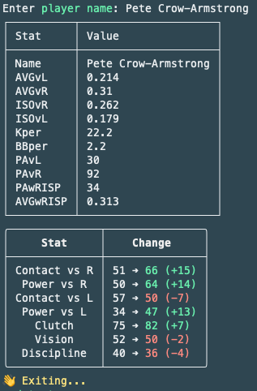

# MLB-the-Show-Flip-Tracker

FlipTracker scrapes MLB The Show 25’s Community Market API and analyzes listings to identify undervalued cards based on real-time market arbitrage.

---

## Project Summary

FlipTracker scrapes **MLB The Show 25’s Community Market API** and analyzes listings to identify undervalued cards based on **real-time market arbitrage**. The tool supports:

- ✅ Searching for player listings by name  
- 📈 Identifying the **Top 25 daily flips** by profit margin  
- 💰 Filtering **budget flips** within a custom stub cap  
- 🧾 **Tracking and logging flip profits** locally using SQLite 
- 📊 Viewing your full profit ledger with detailed statistics
- !!! Currently working on long term predictions for investing in position players !!!

- **Data gathered from fangraphs**


All data is visualized with **Spectre.Console** tables and prompts, providing a modern CLI experience.

---

## 🛠 Technologies Used

| Technology           | Purpose                              |
|----------------------|--------------------------------------|
| **C# .NET**          | Core application logic               |
| **HttpClient**       | Web API integration                  |
| **SQLite**           | Persistent local profit tracking     |
| **Spectre.Console**  | Advanced CLI visuals/interaction     |
| **Threading/Async**  | Parallelized page fetching for speed |

---

## 📈 Profit Margin Strategy

FlipTracker calculates the profit of a flip using:

```csharp
Margin = (int)(SellPrice * 0.9 - BuyPrice)
```

---
``` bash
FlipTracker/
│
├── CLI/                → User interface (menu prompts, printers)
├── Models/             → Data records for Players and Flips
├── Services/
│   ├── ShowDDClient    → API interaction logic
│   ├── Flipper         → Flip analysis logic
│   ├── FlipLogger      → Local flip tracking and SQLite integration
│   └── DatabaseService → SQLite setup and access
├── Data/
│   └── FlipTracker.db  → Your profit ledger
├── Utils/              → Reusable UI tools (e.g. Spinner, formatting)
└── Program.cs          → Startup entry and menu bootstrapping
```

---

## How to Run
```bash
git clone https://github.com/yourusername/FlipTracker

cd FlipTracker

dotnet restore

dotnet run
```

---
